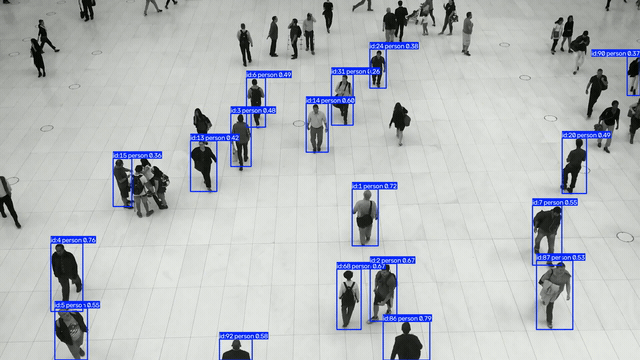
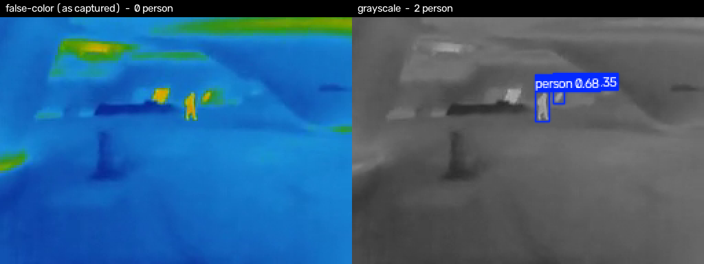

# Real-time Object Detection and Tracking

A web application that detects objects in a video and tracks them across frames. Upload a clip,
and the app returns an annotated video with bounding boxes and persistent track IDs, along with
per-class counts and measured throughput.

Detection uses off-the-shelf pretrained YOLO weights; tracking uses ByteTrack or BoT-SORT.
The point of the project is not a new model but a working application around one.

## Demo



Two seconds of output from the bundled sample clip, produced by YOLO11n with ByteTrack at an
inference size of 640. Every box carries a track ID, and a given person keeps the same ID from
frame to frame rather than being re-detected as someone new. The full run over this clip
registered 52 unique tracks.

<!-- TODO: add docs/screenshot.png, a capture of the Gradio interface -->

## Features

- Detection plus tracking: objects keep a consistent ID across frames instead of being re-detected independently.
- Model selection: YOLO11n, YOLO11s, YOLOv8n, YOLOv8s (COCO, 80 classes).
- Tracker selection: ByteTrack (faster) or BoT-SORT (uses appearance cues, more robust under occlusion).
- Adjustable confidence, NMS IoU, and inference resolution, so the speed/accuracy trade-off is visible in the UI.
- Measured performance: milliseconds per frame, inference FPS, and end-to-end pipeline FPS including decode and encode.
- Per-class statistics separating *unique tracks* from *peak simultaneous detections*.
- Thermal input support: a preprocessing selector that makes an RGB-pretrained model usable on
  infrared footage (measured below).
- Input from file upload, webcam, or bundled sample clips.

## How it works

```
video -> OpenCV frame decode
      -> YOLO detection (conf / iou / imgsz)
      -> ByteTrack or BoT-SORT association -> track IDs
      -> overlay rendering + H.264 re-encode
      -> annotated video, throughput metrics, per-class counts
```

Three details worth noting:

- **Tracker state resets per run.** The first frame of each run calls the tracker with `persist=False`,
  so IDs from a previous video never leak into the next one.
- **Counts use unique track IDs, not per-frame detections.** A person visible for 100 frames counts once.
  Peak simultaneous detections are reported separately, since the two numbers answer different questions.
- **Output is re-encoded to H.264 (yuv420p).** OpenCV's default mp4v output is not playable in most
  browsers. If a system `ffmpeg` is unavailable, the binary bundled with `imageio-ffmpeg` is used.

## Thermal (infrared) input

Surveillance and targeting systems rarely see only daylight RGB, so the app carries a preprocessing
selector and a thermal sample clip. The interesting part is how badly a COCO-pretrained,
visible-light model handles infrared, and how much of that gap is closed by a two-line change.



Both panels are the same frame. On the left, two people stand out clearly to a human eye and the
detector finds neither; on the right, the identical frame with the color palette stripped out
yields both.

Across the whole 10-second clip (151 frames, YOLO11n, 640, conf 0.25):

| Preprocessing | Detections | of which person | Most frequent false classes |
| --- | --- | --- | --- |
| As captured (false-color) | 59 | 5 | kite 35, traffic light 16 |
| Grayscale | 132 | 60 | airplane 30, truck 15 |
| Grayscale + CLAHE | 152 | 46 | truck 34, skateboard 34 |

Run through the tracker, that becomes 0, 3 and 4 unique person tracks respectively.

- **The palette, not the sensor, is what breaks the model.** A thermal camera's ironbow mapping
  paints temperature as hue, so a warm body arrives as a saturated orange blob — a color
  distribution nothing in COCO resembles. Discarding the palette and keeping luminance raises
  person detections from 5 to 60, a 12× difference from a color-space conversion.
- **CLAHE is not a free win.** Local contrast equalization finds more objects overall but fewer
  people, and it invents trucks and skateboards out of amplified background texture. It is offered
  as an option rather than a default because the measurement did not support making it one.
- **Preprocessing narrows the domain gap; it does not close it.** Even the best configuration
  reports ~30 phantom aircraft in ten seconds of street footage. A visible-light detector is not
  an infrared detector, and the real fix is training data from the target sensor — this toggle
  makes the size of that gap visible instead of papering over it.

```bash
python -m src.pipeline samples/thermal-street.mp4 --preprocess "그레이스케일 (열화상)"
```

## Deployment runtime benchmark

A second tab runs the same weights through **PyTorch, ONNX Runtime FP32, and ONNX Runtime INT8**
and measures what actually decides whether a model ships to a device: per-frame latency, file
size, and how much detection quality the conversion costs.

Measured on an AMD Ryzen 5 5600 (6 cores, AVX2, no VNNI), YOLOv8n, 640×640, 40 frames, 6 threads,
ONNX Runtime 1.19. Each figure is the mean of two runs, which agreed within 6%:

| Runtime | Median | p95 | Model | Agreement with PyTorch |
| --- | --- | --- | --- | --- |
| PyTorch FP32 | 47 ms | 49 ms | 6.5 MB | baseline |
| ONNX Runtime FP32 | 31 ms (1.50×) | 34 ms | 12.9 MB | 99.1% |
| ONNX Runtime INT8 | 31 ms (1.48×) | 35 ms | 3.6 MB | 93.6% |

Latency is the forward pass only, with pre- and post-processing excluded. There are no labels for
this footage, so instead of reporting an mAP that could not be computed honestly, quality is the
share of PyTorch detections the converted model reproduces at IoU 0.5 with the same class.

Four things this exercise turned up, all of which shaped the implementation:

- **Quantizing the whole graph produces a model that detects nothing.** Static INT8 across every
  op returned zero detections on every frame. Inspecting the raw output shows why: YOLO's final
  tensor packs box coordinates (0–640) and class scores (0–1) together, and full-graph quantization
  gives that tensor a single 8-bit scale of 2.5. Every class score rounds to zero (max 0.82 in FP32,
  0.00 in INT8) while the boxes survive. Restricting quantization to `Conv` leaves the output in
  floating point and keeps 93.6% of detections.
- **YOLO11 cannot be statically quantized by ONNX Runtime at all.** Its C2PSA attention block
  fails in the quantizer (`Only an existing tensor can be modified, '.../attn/Softmax_output_0'`),
  and excluding those nodes does not help — the calibrator has already recorded the tensor. The
  benchmark reports this rather than hiding it, and YOLOv8 is the default for this tab. Model
  architecture constrains the deployment path, not just the accuracy number.
- **The first version of this table was measured on one thread, and nothing said so.** Ultralytics
  writes `OMP_NUM_THREADS=1` into the process environment when it is imported. The benchmark's
  worker subprocesses inherited it, so PyTorch and ONNX Runtime both ran single-threaded and
  reported 113 / 90 / 75 ms instead of 47 / 31 / 31 ms. It surfaced only because the C++ build ran
  the same model in 29 ms. Changing the parent process one step at a time isolated it: a worker
  that measured 30 ms on its own took 87 ms once the parent had merely imported the library. The
  thread count is now pinned explicitly for every worker, and the tracking tab, which the same
  variable had held to one thread, resets it after import. The conclusion changed with the numbers:
  the inflated figures showed INT8 1.2× faster than FP32, and the corrected ones show no difference.
- **INT8 bought size, not speed.** The quantized model is 3.6× smaller than the FP32 ONNX file and
  keeps 93.6% of detections, but on this CPU with ONNX Runtime 1.19 it runs no faster than FP32.
  The C++ build, on ONNX Runtime 1.29, does measure 1.19×; the runtime version is the likely
  factor, though that has not been isolated.

```bash
python -m src.benchmark samples/people-walking.mp4 --model YOLOv8n --frames 40
```

Exported and quantized models are cached under `models/`, so only the first run pays the
conversion cost.

## C++ inference CLI

`cpp/` holds a standalone C++17 program that runs the same exported ONNX model with no Python
involved — an executable, the model file, and the ONNX Runtime shared library are the whole
deployment. It is the shape an embedded target usually needs.

It links only ONNX Runtime; image decoding uses the single-header `stb` libraries rather than
OpenCV, and letterboxing, output decoding and per-class NMS are implemented directly.

```bash
cd cpp
cmake -B build -DONNXRUNTIME_ROOT=/path/to/onnxruntime-win-x64-1.29.0
cmake --build build --config Release

./build/yolo_infer ../models/yolov8n_640.onnx ../frames --threads 6 --out annotated
```

Measured on the same machine, 20 frames of 1920×1080, 6 threads:

| Build | Median | Throughput |
| --- | --- | --- |
| FP32 ONNX | 29.3 ms | 34 FPS |
| INT8 ONNX | 24.7 ms | 40 FPS |

FP32 lands within 2 ms of the Python ONNX Runtime figure (31 ms), so moving to C++ did not change
inference speed: the forward pass runs in the same library either way. What the C++ build removes
is everything else that would have to be deployed alongside it. INT8 is 1.19× faster here but not
in Python; the C++ build links ONNX Runtime 1.29 while the Python environment is pinned to 1.19,
the last release supporting Python 3.9, and that version difference has not been isolated.

Correctness was checked against the Python pipeline on identical frames: 672 detections
(646 person) from the C++ postprocessing versus 669 (644 person) from Ultralytics, a difference
of 0.45% overall and 0.31% for person. The likely source is nearest-neighbour versus bilinear
resizing in the letterbox step, though that has not been isolated.

Two Windows details worth noting, since both produce silent failures:

- The entry point is `wmain`, and paths stay as `std::filesystem::path` end to end. A narrow
  `argv` is encoded in the system code page, so any non-ASCII path is unrecoverable by the time
  it reaches the program; `stb` only accepts narrow paths, so files are opened with `_wfopen` and
  handed over as a `FILE*`.
- The MinGW build links its runtime statically. Without that the executable depends on
  `libstdc++`, `libgcc` and `libwinpthread` DLLs and dies with a bare exit code on any machine
  that lacks the toolchain.

## Running locally

```bash
git clone https://github.com/Kimhyeonjung06/realtime-object-detection-tracking-app.git
cd realtime-object-detection-tracking-app

python -m venv .venv && source .venv/bin/activate   # Windows: .venv\Scripts\activate
pip install -r requirements.txt

python scripts/fetch_samples.py   # optional, downloads sample clips
python app.py                     # http://127.0.0.1:7860
```

Model weights (`yolo11n.pt` and friends) download automatically on first use.
Python 3.10 or newer is recommended; 3.9 also works through the version markers in `requirements.txt`.

The pipeline runs standalone as well:

```bash
python -m src.pipeline samples/people-walking.mp4 --model YOLO11n --imgsz 480
```

## Tech stack


| Area | Technology |
| --- | --- |
| Detection | Ultralytics YOLO11 / YOLOv8, COCO-pretrained |
| Tracking | ByteTrack, BoT-SORT |
| Deployment | ONNX, ONNX Runtime, INT8 static quantization |
| Video | OpenCV, FFmpeg |
| Interface | Gradio Blocks |
| Native build | C++17, CMake, ONNX Runtime C++ API, stb |

## Project layout

```
app.py                    Gradio interface (entry point)
src/pipeline.py           Detection and tracking pipeline, UI-independent, also runnable as a CLI
src/benchmark.py          ONNX export, INT8 static quantization, runtime measurement
cpp/                      Standalone C++17 inference CLI (ONNX Runtime, no Python)
scripts/fetch_samples.py  Sample video downloader
samples/                  Demo clips, including thermal footage (see samples/SOURCES.md)
apt.txt                   System packages (ffmpeg, libgl1)
requirements.txt
```

The pipeline is kept separate from the interface so the same code can back a web app, a CLI, or a
batch job without modification.

## Notes

- Reported FPS is measured on whatever hardware the app runs on. A CPU produces single-digit
  numbers; a GPU is considerably faster. No figures here are estimated or scaled.
- The models are public pretrained checkpoints, not trained for this project.
- Processing is capped at 20 seconds of video by default for responsiveness.

## License

MIT
